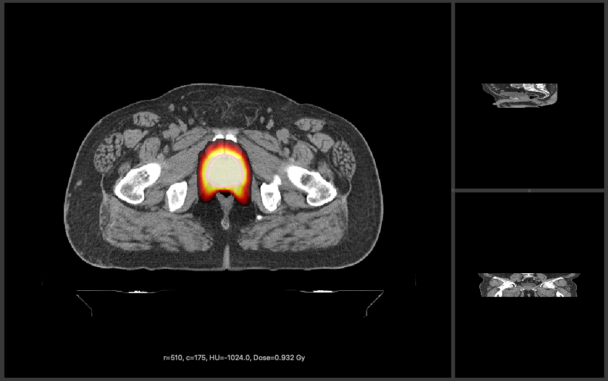
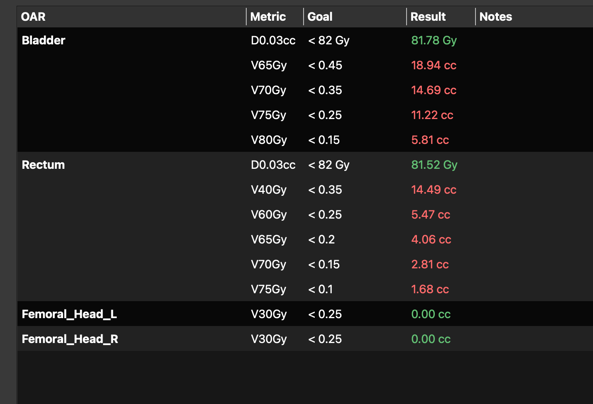
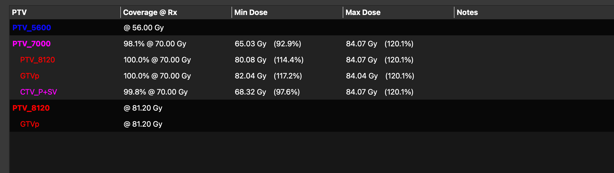

# Peer Review

Peer Review is a Python desktop application for radiotherapy plan review. It loads CT, RTSTRUCT, RTDOSE, and RTPLAN DICOM data, displays axial/sagittal/coronal dose overlays and contours, computes DVHs and constraint results, and provides target-focused analysis for conventional and stereotactic plans.

## Screenshots

### Axial Review



### Constraints



### Targets



The DVH tab can be added here later with a dedicated screenshot.

## Main Features

- Axial, sagittal, and coronal image review
- Dose color wash and editable isodose lines
- Structure overlays with independent Axial and DVH visibility controls
- Background DVH calculation
- Constraint evaluation from `constraints.xlsx`
- Target analysis with coverage, minimum dose, maximum dose (`D0.03cc`), and stereotactic indices
- Save/load of DVH, constraints, targets, and notes via JSON cache

## Project Files

- `peer.py`: application entry point
- `peer_viewer.py`: main GUI and workflow logic
- `peer_viewer_support.py`: shared viewer support classes
- `peer_helpers.py`: geometry, DVH, and metric helpers
- `peer_dvh.py`: higher-accuracy DVH engine
- `peer_io.py`: DICOM and constraints loading
- `peer_models.py`: shared data models
- `peer_widgets.py`: reusable Qt widgets
- `constraints.xlsx`: workbook containing selectable constraint tables

## Requirements

- Python 3.12
- PySide6
- pyqtgraph
- numpy
- pydicom
- openpyxl

Optional but useful:

- scipy

## Installation

Create or activate a Python environment, then install the required packages:

```bash
python3 -m pip install PySide6 pyqtgraph numpy pydicom openpyxl scipy
```

If `scipy` is not installed, the application still runs, but some geometry and morphology operations fall back to slower or simpler paths.

## Running

From the repository root:

```bash
python3 peer.py
```

## Typical Workflow

1. Launch the app.
2. Load a patient folder containing CT, RTSTRUCT, RTDOSE, and optionally RTPLAN files.
3. Review dose and structures in the Axial tab.
4. Choose a constraint set in the Constraints tab.
5. Review target metrics in the Targets tab.
6. Review or interact with DVHs in the DVH tab.
7. Save the review cache if you want to restore DVH, constraints, targets, and notes later.

## Constraints

Constraint sets are stored in `constraints.xlsx`. The Constraints tab lets you select a workbook sheet, add custom constraints, save results, and reload saved review state for a patient folder.

## Repository Layout

```text
peer.py
peer_viewer.py
peer_viewer_support.py
peer_helpers.py
peer_dvh.py
peer_io.py
peer_models.py
peer_widgets.py
constraints.xlsx
```

## Notes

- Patient DICOM data is not intended to be stored in the repository.
- Runtime cache files such as `peer_dvh_constraints.json` and `peer_load_timing.txt` are ignored by git.

## Roadmap

- Improve documentation around constraints workbook formats
- Add automated validation/smoke tests for common patient-load scenarios
- Continue refining small-target/SRS target metrics against TPS reference values
- Optionally support external high-accuracy engines such as Slicer for selected cases
